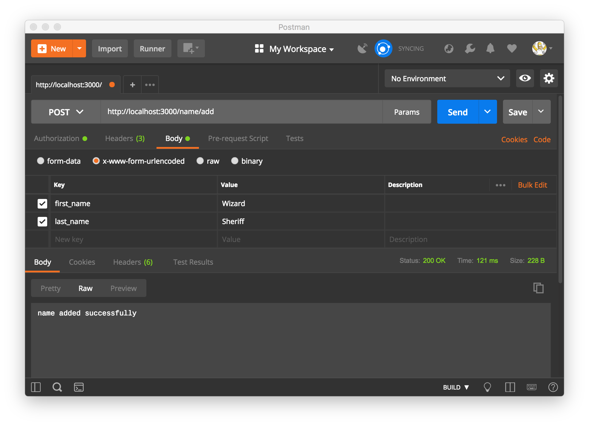

## Basic Routing, HTTP Requests, and CRUD Operations with Express and MongoDB
A route is simply an entry point into your application. So we are going to build routes to perform some HTTP requests with ExpressJS. [(source)](https://www.javascriptjanuary.com/blog/basic-routing-http-requests-and-crud-operations-with-express-and-mongodb)

#### Built with:
* [npm](https://www.npmjs.com/) - Node Package Manager
* [Jest](https://facebook.github.io/jest/) - JavaScript Testing Framework
* [Express](https://expressjs.com/) - Server-side JavaScript Framework
* [MongaDB](https://www.mongodb.com/) - Document-oriented Database Program
* [Postman](https://www.getpostman.com/) - Tool for Testing API
* [mLab](https://mlab.com/) - Managed MongoDB Hosting
* [Dotenv](https://github.com/motdotla/dotenv) - Loads Environment Variables

### Introduction:
[Express](https://expressjs.com/) is a framework for building web applications on top of Node.js. It simplifies the server creation process that is already available in Node. In case you were wondering, Node allows you to use JavaScript as your server-side language.

[MongoDB](https://www.mongodb.com/) is a database. This is the place where you store information for your web websites (or applications).

[CRUD](https://en.wikipedia.org/wiki/Create,_read,_update_and_delete) is an acronym for Create, Read, Update and Delete. It is a set of operations we get servers to execute (POST, GET, PUT and DELETE respectively). This is what each operation does:
- Create (POST) - Make something
- Read (GET)_- Get something
- Update (PUT) - Change something
- Delete (DELETE)- Remove something

If we put CRUD, Express and MongoDB together into a single diagram, this is what it would look like:


HTTP Verb |  Operation |
----------|------------|
GET       |  Read      |
POST      |  Create    |
PUT       |  Update    |
DELETE    |  Delete    |

### Adding our First Routes
Now let's create a route that we can access in the browser. Browsers only serve pages using a GET request, so we need to create a route using Express' get method like this:
```js
app.get('/', function(req, res) {
  res.send("Yep it's working");
});
```
### Creating an Entry
We'll use the POST HTTP verb to create a new entry in our database. Let's create our post route:
```js
app.post('/name/add', (req, res, next) => {

  var name = {
    first_name: req.body.first_name,
    last_name: req.body.last_name
  };

  dbase.collection("name").save(name, (err, result) => {
    if(err) {
    console.log(err);
    }
  res.send('name added successfully');
  });
});
```

### Reading All Entries
Now let's add a function to handle GET requests to our database in Express.
```js
app.get('/name', (req, res) => {
    dbase.collection('name').find().toArray( (err, results) => {
      res.send(results)
    });
});
```
### Reading by ID
We can also make GET requests by id which is automatically assigned to entries in our database. We can add that id to our request via the URL. We can add an Express handler for this type of request like this:
```js
app.get('/name/:id', (req, res, next) => {
    if(err) {
      throw err;
    }

    let id = ObjectID(req.params.id);
    dbase.collection('name').find(id).toArray( (err, result) => {
      if(err) {
        throw err;
      }

      res.send(result);
    });
 });
```
### Updating by ID
We learned how to add data using a POST request and how to retrieve data using a GET request. Now we are going to add a handler to update an existing record by id using a PUT request:
```js
app.put('/name/update/:id', (req, res, next) => {
    let id = {
      _id: ObjectID(req.params.id)
    };

    dbase.collection("name").update({_id: id}, {$set:{'first_name': req.body.first_name, 'last_name': req.body.last_name}}, (err, result) => {
      if(err) {
        throw err;
      }
      res.send('user updated sucessfully');
    });
});
```
### Deleting by ID
Finally, we've arrived at the last phase of this application: deleting entries by id. We will do this by using the DELETE request. Let's create a handler function in our application.
```js
app.delete('/name/delete/:id', (req, res, next) => {
    let id = ObjectID(req.params.id);

    dbase.collection('name').deleteOne(id, (err, result) => {
      if(err) {
        throw err;
      }

      res.send('user deleted');
    });
 });
```